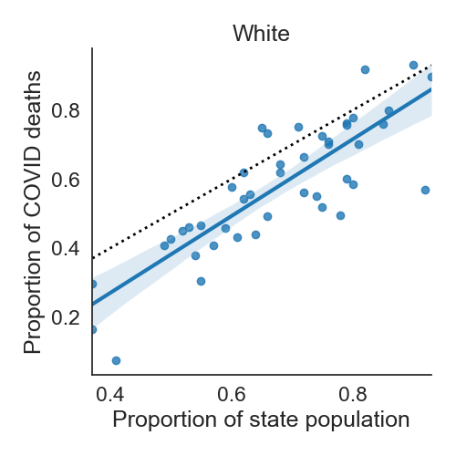
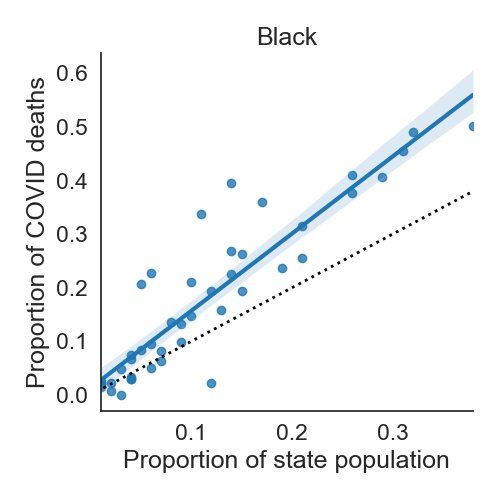

# U.S. state-level cumulative COVID cases and deaths by race

## Overview

Data on the number of COVID cases and deaths by race and ethnicity for each
U.S. state and Washington D.C.
Recent data on the racial/ethnic make-up of each state is included as well
for comparison.

## Description

The original COVID data is [here](US-covid-cases-deaths-by-state-race.csv)
and the population-level data is [here](US-population-distribution-by-state.csv).
The two sources are combined using [this script](generate-US-covid-cases-deaths-population-by-state-race.py),
with the output [here](US-covid-cases-deaths-population-by-state-race.csv).

## Example Analysis

This [python script](create-expected-versus-observed-deaths-plots.py) was used
to compare the expected proportion of COVID deaths (based on the population) with the
observed proportion of deaths.
Each dot is a single state and the blue line is least squares linear regression fit
and 95% confidence interval.
The black dotted "`x = y`" is where we would expect states to fall if COVID were
equally deadly to blacks and non-blacks.

While further adjustments would be ideal (for example, to account for age composition effects),
this data suggests COVID disproportionately affects the black community.
However, it does not provide a causal explanation.

## Sources and Licenses

* [US-covid-cases-deaths-by-state-race.csv](US-covid-cases-deaths-by-state-race.csv): <a href="https://covidtracking.com/">The COVID Tracking Project</a>.
This data is licensed under a <a rel="license" href="http://creativecommons.org/licenses/by-nc/4.0/">Creative Commons Attribution-NonCommercial 4.0 International License</a>
* [US-covid-cases-deaths-population-by-state-race.csv](US-covid-cases-deaths-population-by-state-race.csv): <a href="https://www.kff.org/other/state-indicator/distribution-by-raceethnicity/">Kaiser Family Foundation: Population Distribution by Race/Ethnicity (2018)</a>
