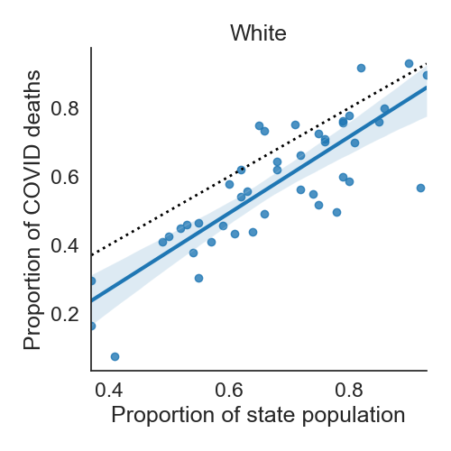

# U.S. state-level COVID cases and deaths by race

## Overview

Data on the number of COVID cases and deaths by race and ethnicity for each
U.S. state and Washington D.C.
Recent data on the racial/ethnic make-up of each state is included as well
for comparison.

## Description

### Data

The [original COVID data](data/US-covid-cases-deaths-by-state-race.csv) contains
information on COVID cases and deaths by race and ethnicity in each state or
territory.
In the following table, XXX can take on the values *Total*, *White*, *Black*,
*LatinX*, *Asian*, *AIAN*, *NHPI*, *Multiracial*, *Other*, *Unknown*,
*Ethnicity_Hispanic*, *Ethnicity_NonHispanic*, and *Cases_Ethnicity*.
Note that "AIAN" abbreviated "American Indian/Alaska Native"
and "NHPI" abbreviates "Native Hawaiian/Other Pacific Islander".

Column name  | Column meaning | Example value
-------------|----------------|---------------
State        | Two-letter abbreviation for the state/territory, including Washington D.C. and Puerto Rico. | IN
Cases_XXX    | Number of COVID cases in group XXX.   | 285
Deaths_XXX   | Number of COVID deaths in group XXX. | 469

Population-level [demographic data](data/US-population-distribution-by-state.csv)
is also provided.
In the following table, YYY can take on the values *White*, *Black*, *Hispanic*,
*American Indian/Alaska Native*, *Asian*,
*Native Hawaiian/Other Pacific Islander*, and *Two Or More Races*.

Column name  | Column meaning | Example value
-------------|----------------|---------------
Location     | State/territory name, including Puerto Rico and United States. | Indiana
YYY          | Proportion of population who are YYY.   | 0.21
Total        | Total of proportions, which is always 1.0. | 1.0

The two sources are combined into a [single dataset](data/US-covid-cases-deaths-population-by-state-race.csv),
which contains all the columns of the sources except the "State" column.
In also contains additional columns with proportions of cases and deaths by
group.

Column name  | Column meaning | Example value
-------------|----------------|---------------
Cases_XXX_proportion | Proportion of COVID cases in group XXX.   | 0.017
Deaths_XXX_proportion   | Proportion of COVID deaths in group XXX. | 0.82

### Scripts

The [python script](python/generate-US-covid-cases-deaths-population-by-state-race.py)
for generating the combined dataset takes no arguments and should be run from
this directory.

## Example Analysis

This [python script](python/create-expected-versus-observed-deaths-plots.py) was used
to compare the expected proportion of COVID deaths (based on the population)
with the observed proportion of deaths.
Each dot is a single state and the blue line is least squares linear regression
fit and 95% confidence interval.
The black dotted line indicates where we would expect states to lie if COVID were
equally deadly to blacks and non-blacks.

While further adjustments would be ideal (for example, to account for age
composition effects), this data suggests COVID disproportionately affects the
black community.
However, it does not provide a causal explanation.

## Sources and Licenses

* *US-covid-cases-deaths-by-state-race.csv*: <a href="https://covidtracking.com/">The COVID Tracking Project</a>.
This data is licensed under a <a rel="license" href="http://creativecommons.org/licenses/by-nc/4.0/">Creative Commons Attribution-NonCommercial 4.0 International License</a>.
* *US-covid-cases-deaths-population-by-state-race.csv*: <a href="https://www.kff.org/other/state-indicator/distribution-by-raceethnicity/">Kaiser Family Foundation: Population Distribution by Race/Ethnicity (2018)</a>.
