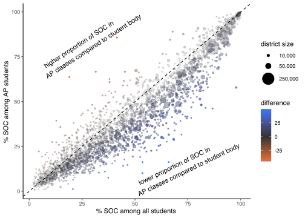

US School Demographics
================
Daniel Sussman
9/13/2020

US Schools - Total Enrollment and AP Course Enrollment by Race
==============================================================

Overview
--------

Description
-----------

### Data

<table>
<colgroup>
<col width="4%" />
<col width="18%" />
<col width="18%" />
<col width="2%" />
<col width="3%" />
<col width="3%" />
<col width="13%" />
<col width="3%" />
<col width="3%" />
<col width="4%" />
<col width="15%" />
<col width="8%" />
<col width="3%" />
</colgroup>
<thead>
<tr class="header">
<th align="left">state</th>
<th align="left">district</th>
<th align="left">school</th>
<th align="left">ap</th>
<th align="left">type</th>
<th align="right">total</th>
<th align="right">American Indian/Alaska Native</th>
<th align="right">Asian</th>
<th align="right">Black</th>
<th align="right">Hispanic</th>
<th align="right">Native Hawaiian/Pacific Islander</th>
<th align="right">Two or More Races</th>
<th align="right">White</th>
</tr>
</thead>
<tbody>
<tr class="odd">
<td align="left">NEW YORK</td>
<td align="left">CHARTER SCHOOL FOR APPLIED TECHNOLOGIES</td>
<td align="left">CHARTER SCHOOL FOR APPLIED TECHNOLOGIES</td>
<td align="left">Yes</td>
<td align="left">ap</td>
<td align="right">32</td>
<td align="right">0</td>
<td align="right">0</td>
<td align="right">2</td>
<td align="right">7</td>
<td align="right">0</td>
<td align="right">4</td>
<td align="right">19</td>
</tr>
<tr class="even">
<td align="left">NEW YORK</td>
<td align="left">CHARTER SCHOOL FOR APPLIED TECHNOLOGIES</td>
<td align="left">CHARTER SCHOOL FOR APPLIED TECHNOLOGIES</td>
<td align="left">Yes</td>
<td align="left">total</td>
<td align="right">2040</td>
<td align="right">13</td>
<td align="right">46</td>
<td align="right">739</td>
<td align="right">553</td>
<td align="right">0</td>
<td align="right">169</td>
<td align="right">520</td>
</tr>
<tr class="odd">
<td align="left">OHIO</td>
<td align="left">McDonald Local</td>
<td align="left">McDonald High School</td>
<td align="left">No</td>
<td align="left">total</td>
<td align="right">407</td>
<td align="right">4</td>
<td align="right">0</td>
<td align="right">4</td>
<td align="right">13</td>
<td align="right">0</td>
<td align="right">7</td>
<td align="right">379</td>
</tr>
</tbody>
</table>

### Scripts

Example Analysis
----------------

``` r
district_percent_soc <- ap_by_race %>%
  group_by(state, district, type) %>%
  summarize(`% SOC` =100*(1- sum(White)/sum(total)), students = sum(total)) %>%
  pivot_wider(
    names_from = c("type"),
    values_from = c("% SOC", "students"),
    names_sep = " ",
    values_fill = 0
  ) %>%
  filter(`% SOC ap` %% 1 != 0, `students total` > 1000)
```

| state        | district                               | % SOC total | % SOC ap |  students total|  students ap|
|:-------------|:---------------------------------------|:------------|:---------|---------------:|------------:|
| PENNSYLVANIA | Clearfield Area SD                     | 4%          | 9%       |            1088|          123|
| ALABAMA      | Walker County                          | 9%          | 10%      |            2314|          256|
| ILLINOIS     | Cons HSD 230                           | 22%         | 20%      |            7471|         2352|
| ILLINOIS     | East St Louis SD 189                   | 99%         | 99%      |            1621|          233|
| MICHIGAN     | Kenowa Hills Public Schools            | 22%         | 11%      |            1100|          251|
| UTAH         | BOX ELDER DISTRICT                     | 15%         | 2%       |            2595|          724|
| INDIANA      | Fort Wayne Community Schools           | 53%         | 39%      |            5931|          293|
| GEORGIA      | Cobb County                            | 59%         | 47%      |           35141|        10914|
| TEXAS        | NORTHWEST ISD                          | 35%         | 32%      |            6002|         2159|
| PENNSYLVANIA | North Penn SD                          | 35%         | 40%      |            3036|          809|
| NEW YORK     | NORTH TONAWANDA CITY SCHOOL DISTRICT   | 9%          | 7%       |            1139|          211|
| ARIZONA      | Florence Unified School District       | 47%         | 49%      |            2879|          119|
| MARYLAND     | Charles County Public Schools          | 71%         | 63%      |            8431|         2237|
| NEW JERSEY   | South Orange-Maplewood School District | 56%         | 36%      |            1886|          561|



Sources and Licenses
--------------------
