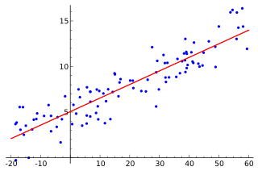

# Template for Contributed Dataset

## Overview

Use this directory as a template if you wish to contribute a dataset.
Each dataset is housed within a separate directory in [datasets](datasets/).
You will need to modify this README with the content described below
using [Markdown](https://guides.github.com/features/mastering-markdown/).

This first section should describe the dataset and how it might be used at a
high level.
We strongly encourage the use of freely available and widely used languages such
R and Python for processing and analysis of data.
All file names should use hyphens (rather than underscores) to separate words.

## Description

### Data

All data files should be placed in a subdirectory named *data*.
The original dataset should have the same name as your directory name plus the
appropriate file type extension
That is your contribution is in *datasets/%dataset%* the relative path would
be *data/%dataset%.csv*.
Auxiliary data should be given description names such as
*country-demographics.csv* or *state-populations.csv*.
Processed versions should be descriptively named
For example, *%dataset%-standardized.csv* or *%dataset%-with-demographics.csv*.

This section should provide a detailed description of the data, including
the name of each column, its meaning, and an example value.
We suggest using a table like the following:

Column name  | Column meaning | Example value
-------------|----------------|---------------
row_number   | positive integer index of the row | 391
date         | date the observation was collected in YYYY-MM-DD format | 1999-11-29
length       | length of observation in cm | 77

If there are multiple versions, describe how they differ.
Include separate data description tables for columns not present in the original
data.

### Scripts

Scripts used to create the processed versions from the original should be placed
in a subdirectory named after the language.
For example, *R* or *python*.
Scripts should be prefixed with *generate-*, then the name of the dataset
that is output.
For example, *generate-%dataset%-standardized.R* or
*generate-%dataset%-with-demographics.R*.

This section should describe how to use the scripts, along with any other useful
details that were not included in the dataset description above.

## Example Analysis

You may optionally provide example analyses, including the output of numeric
and graphical results like the examples below.
Please include any scripts used to generate the results and use descriptive
names such as *%dataset%-linear-regression.R*.
Analysis scripts should be placed in the appropriate language subdirectory.  

Variable | Coefficient
---------|------------
intercept | 5.0
x | 0.15

*Wikimedia Commons / Public Domain*

## Sources and Licenses

Provide sources for all data.
If they differ from the defaults, specify the license(s) for the data and
scripts.
